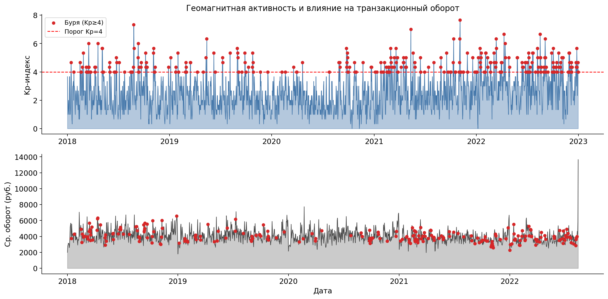
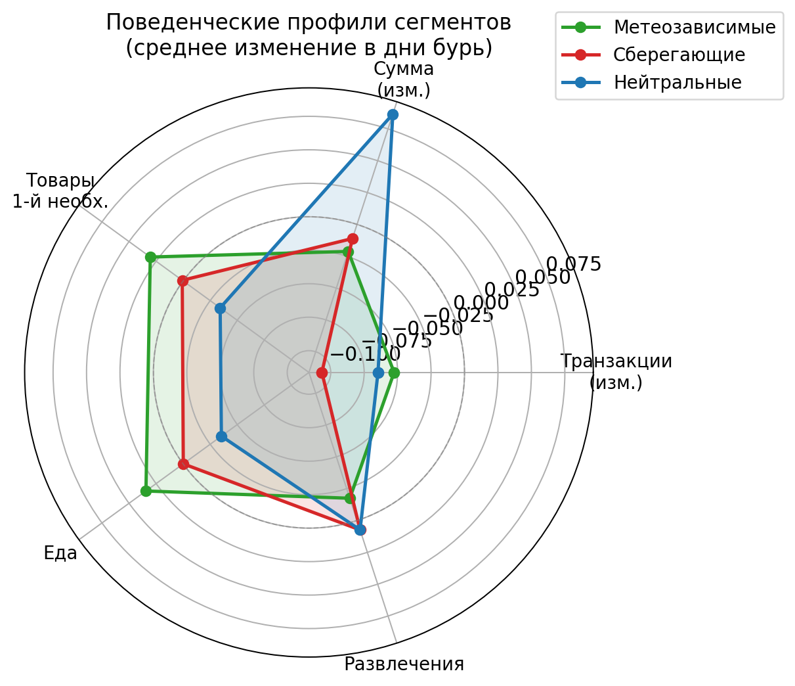
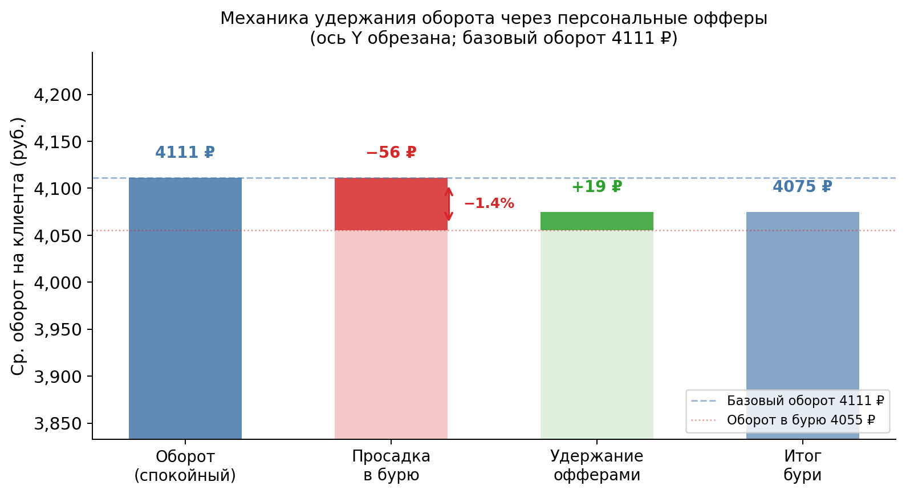
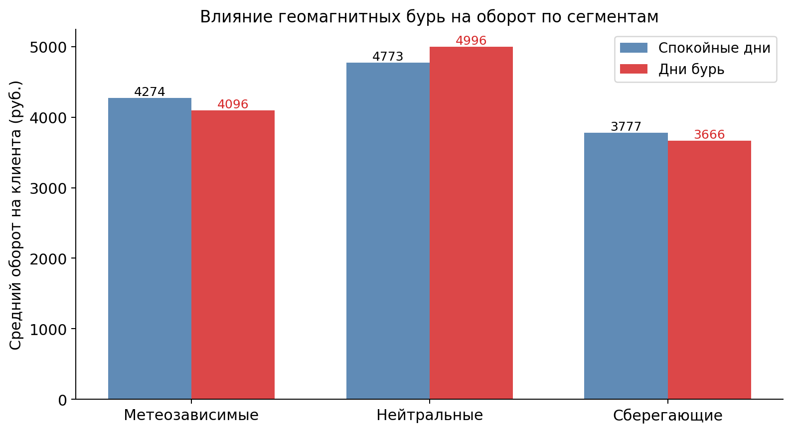
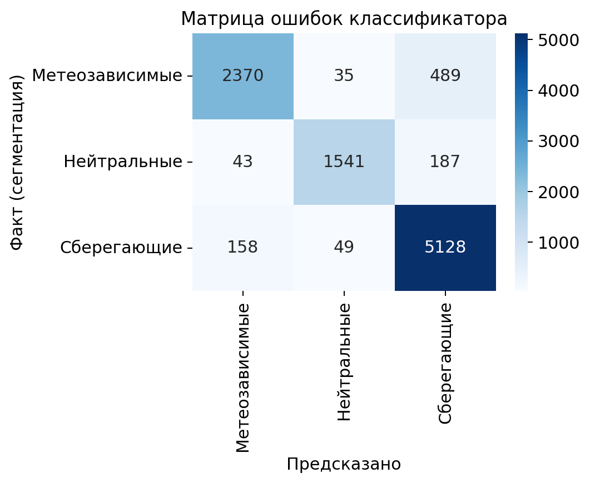
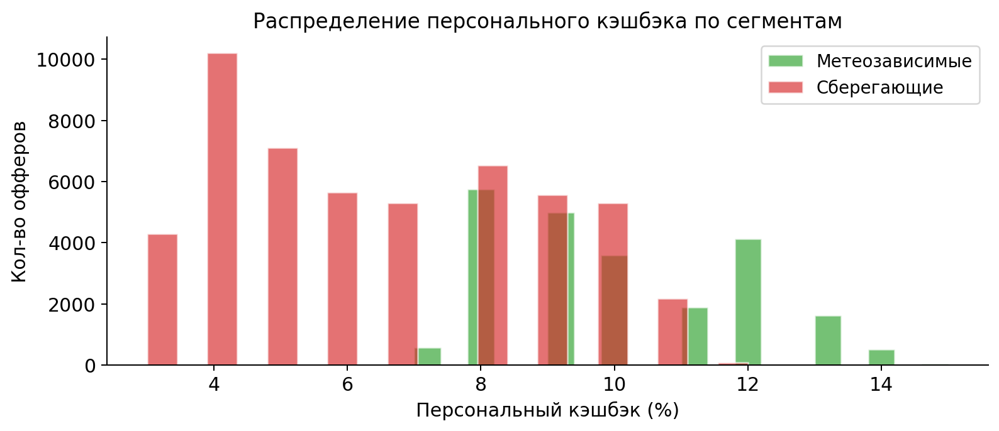
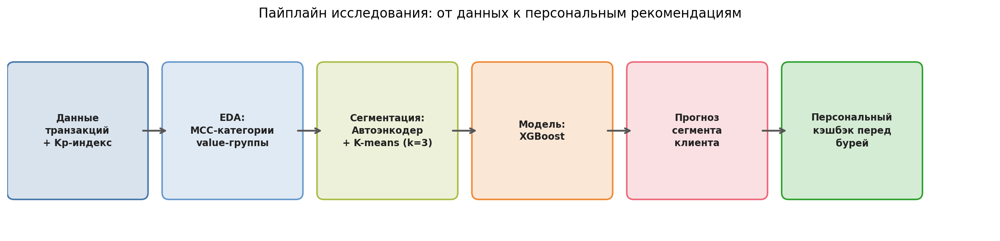

# Сегментация банковских клиентов по чувствительности к геомагнитным бурям

Предиктивная рекомендательная система, которая обнаруживает падение транзакционной активности во время геомагнитных бурь и заблаговременно отправляет персональные офферы с повышенным кэшбэком на онлайн-сервисы.

---

## Проблема

Во время геомагнитных бурь часть клиентов банка снижает транзакционную активность. На данных 10 000 клиентов за 2018–2022 гг. зафиксировано падение среднего дневного оборота на **−1.35%** (−55.6 ₽/клиент/день бури). При 235 штормовых днях суммарный оборот под риском составляет **130.7 млн ₽**.

**Гипотеза (поведенческая экономика):** геомагнитная буря вызывает у чувствительных людей стресс и усталость → стратегия энергосбережения → человек избегает лишних физических действий, в том числе походов в магазины. Персональные офферы на онлайн-каналы (доставка, стриминг, аптеки) компенсируют просадку без физических усилий для клиента.

---

## Ключевые результаты

| Метрика | Значение |
|---|---|
| Данные | 10 000 клиентов, 1 688 дней (2018–2022) |
| Штормовых дней (Kp ≥ 4) | 235 (13.9% периода) |
| Просадка оборота | −1.35% = −55.6 ₽/клиент/день |
| Silhouette (автоэнкодер + K-means) | **0.214** vs 0.200 (baseline) |
| F1-macro предиктивной модели (CV) | **0.652 ± 0.010** |
| Оцениваемый эффект удержания | **~45.7 млн ₽** за период |

### Сегменты клиентов

| Сегмент | Доля | Реакция на бурю | Стратегия офферов |
|---|---|---|---|
| Сберегающие | 53.3% | tx −10.7%, amt −1.1% | Доставка продуктов, кэшбэк 5–12% |
| Метеозависимые | 28.9% | tx −5.3%, food +3.4% | Доставка еды, аптеки, стриминг, 7–15% |
| Нейтральные | 17.7% | amt +8.7% | Рестораны, базовые офферы |

---

## Графики

<table>
<tr>
<td><br><sub>Влияние уровня Kp на оборот</sub></td>
<td><br><sub>Радарные профили трёх сегментов</sub></td>
</tr>
<tr>
<td><br><sub>Просадка и удержание оборота</sub></td>
<td><br><sub>Оборот в тихие дни vs. бури</sub></td>
</tr>
<tr>
<td><br><sub>Матрица ошибок классификатора</sub></td>
<td><br><sub>Распределение кэшбэка по сегментам</sub></td>
</tr>
</table>



---

## Архитектура пайплайна

```
transactions.csv  ──┐
kp.csv (Kp-индекс) ──┤  01_data_prep.py  →  02_eda.py  →  03_segmentation.py
mcc_codes.csv     ──┘        │                                      │
                        (parquet-файлы)              (автоэнкодер + K-means)
                                                              │
                                                       04_model.py  (XGBoost)
                                                              │
                                                   05_recommendations.py
                                                              │
                                              06_defense_plots.py / dashboard.py
```

**Шаги пайплайна:**

1. **`01_data_prep.py`** — параллельная (3 процесса) загрузка и нормализация транзакций; джоин с Kp-индексом NOAA; сохранение `client_day.parquet`, `kp.parquet`, `mcc.parquet`
2. **`02_eda.py`** — EDA: t-test и Mann-Whitney по MCC-категориям, поведенческие профили по value-группам
3. **`03_segmentation.py`** — baseline K-means → автоэнкодер PyTorch → K-means в латентном пространстве (k=3); признаки: 7 поведенческих дельт во время бурь
4. **`04_model.py`** — XGBoost с 46 признаками в 3 группах (past-storm track record, quiet-day statistics, pre-storm window); честный временной сплит без leakage; калибровка вероятностей
5. **`05_recommendations.py`** — триггерные офферы за 1–3 дня до бури; кэшбэк масштабирован по `storm_proba` клиента
6. **`06_defense_plots.py`** — все 8 защитных графиков
7. **`dashboard.py`** — интерактивный Streamlit-дашборд

---

## Структура репозитория

```
.
├── 01_data_prep.py          # Загрузка и препроцессинг данных
├── 02_eda.py                # Разведочный анализ
├── 03_segmentation.py       # Сегментация (автоэнкодер + K-means)
├── 04_model.py              # Предиктивная модель (XGBoost)
├── 04_lstm.py               # Экспериментальная LSTM-модель (не в основном пайплайне)
├── 05_recommendations.py    # Система рекомендаций
├── 06_defense_plots.py      # Графики для защиты
├── dashboard.py             # Streamlit-дашборд
├── run_nir.sh               # Запуск в tmux
├── requirements.txt         # Зависимости Python
├── kp.csv                   # Kp-индекс геомагнитной активности (NOAA)
├── mcc_codes.csv            # Справочник MCC-кодов
├── data/                    # Промежуточные parquet-файлы (генерируются, в .gitignore)
├── plots/
│   └── defense/             # Итоговые графики (в репозитории)
└── logs/                    # Логи запусков (в .gitignore)
```

> `transactions.csv` — исходные транзакционные данные, **не входит в репозиторий** (конфиденциальные данные, 1 GB).

---

## Быстрый старт

### Требования

Python ≥ 3.10, pip:

```bash
pip install -r requirements.txt
```

### Подготовить данные

Положить в корень репозитория:
- `transactions.csv` — транзакции клиентов (формат: `client_id, date, mcc, amount, group, value`)
- `kp.csv` уже есть в репозитории (публичные данные NOAA)
- `mcc_codes.csv` уже есть в репозитории

### Запуск пайплайна

```bash
python3 01_data_prep.py       # ~5–10 мин (параллельная загрузка)
python3 02_eda.py
python3 03_segmentation.py    # ~3–5 мин (обучение автоэнкодера)
python3 04_model.py           # ~2–3 мин (XGBoost + CV)
python3 05_recommendations.py
python3 06_defense_plots.py
```

Или через tmux (сессия не умирает при дисконнекте):

```bash
chmod +x run_nir.sh
./run_nir.sh 01_data_prep.py   # запустить шаг
./run_nir.sh attach             # подключиться к активной сессии
```

### Запуск дашборда

```bash
python3 -m streamlit run dashboard.py --server.port 8501
# http://localhost:8501
```

---

## Методология

### Сегментация

- **Baseline:** K-means на 7 вручную сконструированных признаках (изменение частоты/суммы транзакций, сдвиги по категориям MCC во время бурь)
- **Основной метод:** автоэнкодер PyTorch (encoder → bottleneck → decoder) обучается восстанавливать поведенческий профиль → K-means в латентном пространстве
- Silhouette вырос с 0.200 до **0.214**; кластеры интерпретируемы через поведенческую экономику

### Предиктивная модель

XGBoost обучается предсказывать сегмент клиента **до** наступления бури, используя три группы признаков без leakage:

| Группа | Кол-во | Описание |
|---|---|---|
| Past-storm track record | 8 | Реакция клиента на первые 60% бурь в датасете |
| Quiet-day statistics | 21 | CV, волатильность, персентили p25/p75/IQR из тихих дней |
| Pre-storm window | 17 | mean/std/trend за 14 дней до каждой бури |

5-fold StratifiedKFold CV: F1-macro = **0.652 ± 0.010**

### Система рекомендаций

Оффер отправляется за 1–3 дня до прогнозируемой бури. Размер кэшбэка персонализирован:

```
cashback = base + (max − base) × storm_proba
```

Все офферы — онлайн-каналы (принцип энергосбережения: минимум физических усилий для клиента).

---

## Данные

| Файл | Статус | Описание |
|---|---|---|
| `transactions.csv` | не в репозитории | 10 000 клиентов, ~16.8 млн записей, 2018–2022 |
| `kp.csv` | в репозитории | Kp-индекс, NOAA, публичные данные |
| `mcc_codes.csv` | в репозитории | Справочник MCC-кодов мерчантов |

---

## Известные ограничения

- Автоэнкодер недетерминирован при многопоточном PyTorch: размеры сегментов варьируются между запусками (~±5%). Профили кластеров стабильны.
- Silhouette = 0.214 — кластеры частично перекрываются, что ограничивает точность предиктивной модели.
- Эффект бурь небольшой (−1.35%), модель работает на тонком сигнале.

---

## Автор

Захаров — НИР, 2026
